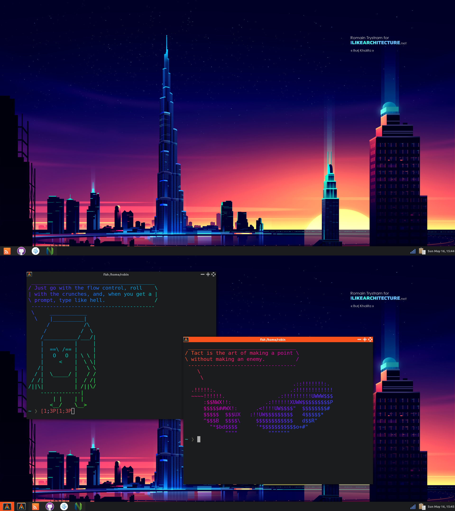

# Awesome

Awesome is both a tiling and a floating window manager. I like to use it as an floating one.  
My Awesome config uses nitrogen for wallpapers, because then it has the same wallpaper as my other window managers. It has the frontend-delight color scheme and some other tweaks.

My awesome config has a taskbar at the bottom, that also contains systray and clock widgets.

# Screenshots

