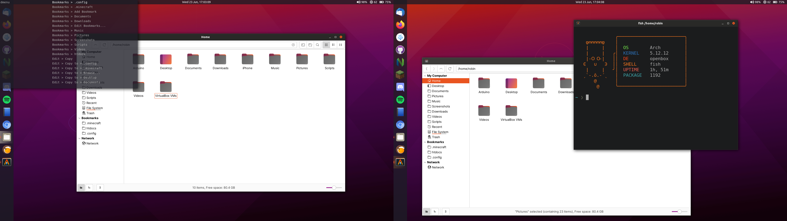

# Openbox

Openbox is my favorite floating window manager. It is lightweight, fast and customizable. My openbox config uses nitrogen for wallpapers and has a pretty simple menu. I'm using Yaru for GTK+ and KvYaru for QT. The Openbox theme is also Yaru, but I previously also used a custom version of KvAdapta. I'm using plank for a dock. For searching and application lauching I'm using rofi. The icon theme is again Yaru.

Dependencies: `firefox, alacritty, pactl, xbacklight, playerctl, rofi, dunst, lxsession, nitrogen, betterlockscreen, xcape, lxappearance, lemonbar, polybar`

# Screenshots

# Keybindings

These are the most important keybindings, the rest can be found in rc.xml

Media keys to play, pause, stop and rewind. Volume keys for volume using pactl and brightness keys to manager brightness with xbacklight.

| Keybind | Action |
| --- | --- |
| Super | launch rofi |
| Super+q | kill focused window |
| Super+w | lauch firefox |
| Ctrl+Alt+q | exit openbox |
| Ctrl+Alt+r | reload/restart openbox |

I themed my openbox setup to be similar to Ubuntu Unity. If you want a better Unity clone, check out my Metacity session.