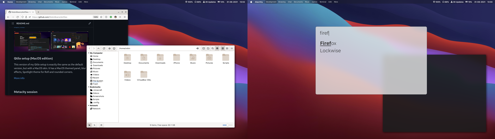

# Qtile (MacOS edition)

Qtile is my daily driver window manager. 

This is my MacOS themed version of my normal Qtile setup.

My config has a top panel with my workspaces, current window title and useful information, and also a systray. The panel has:

- Brightness indicator
- Volume indicator
- Battery indicator
- Date and time

This config uses `feh` for the wallpaper. For networking I'm using NetworkManager-applet (`nm-applet`).  
All workspaces use the master and stack layout (columns in Qtile), exept games and edit. Games uses max, and  
edit a floating layout.  
I also added the HUD functionality from my Metacity session. To search application menus, just hit Alt and rofi will do the rest.

**Important: to get the Spotligth theme for Rofi, download the qmenu-macos and qmoji-macos themes and remove the macos suffix.**

## Setup Firefox theme

This theme has a custom Firefox theme / userChrome. Can be found in my wavefox-lepton project: <https://github.com/RobinBoers/wavefox-lepton>

## Screenshots

## Keybindings
These images are generated using a script in the qtile github repo that can be found here:  

<https://raw.githubusercontent.com/qtile/qtile/master/scripts/gen-keybinding-img>

