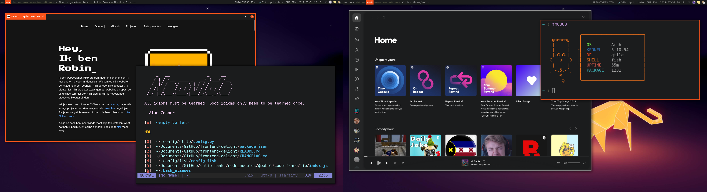
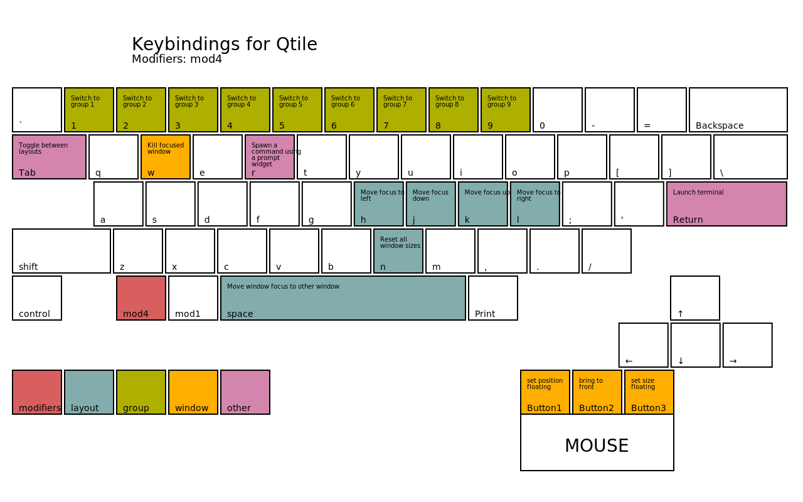
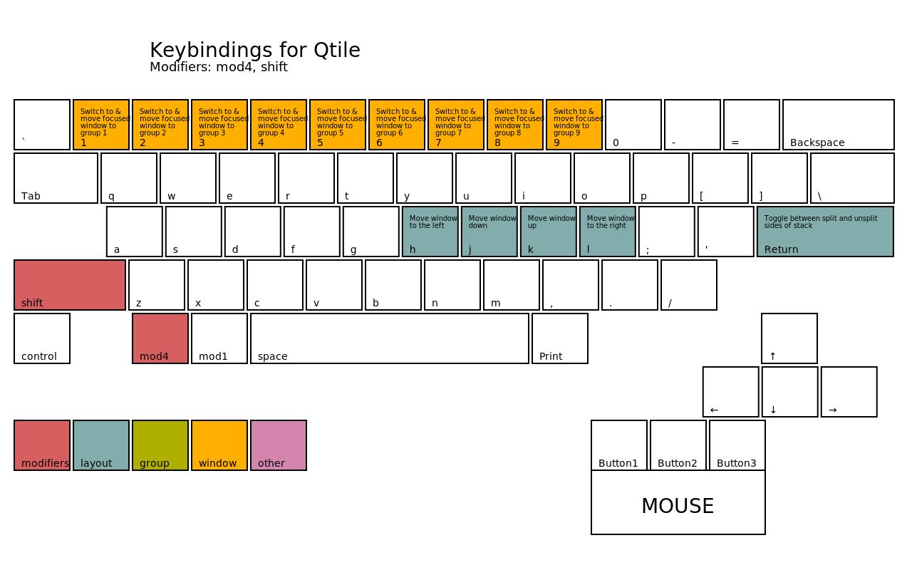
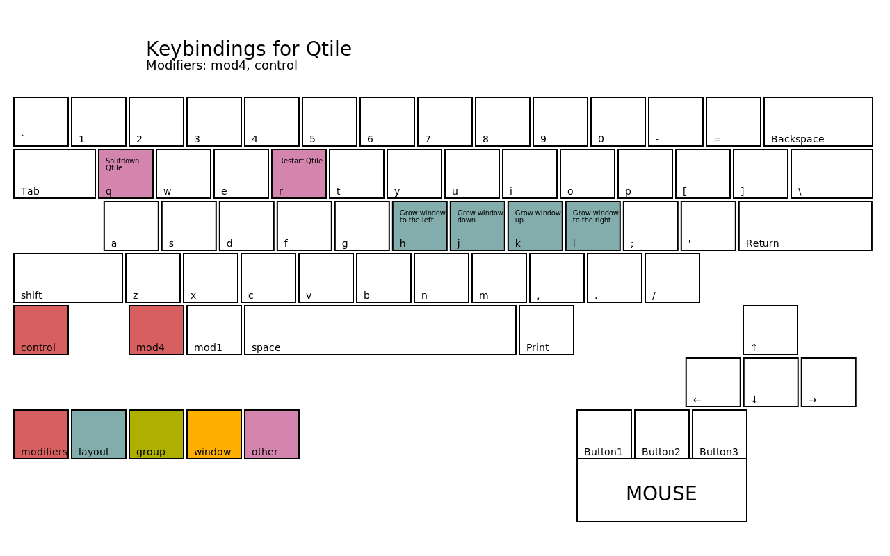

# Qtile

Qtile is my daily driver window manager. 

Also using the default panel in this setup. I customized it to use the frontend-delight color theme. I have gaps because I like them. Keybindings for most regular stuff. Also keybinded the media buttons using playerctl and the brightness stuff with xbacklight. Kvantum KvGnome for QT and Adwaita dark for GTK+. The icons are Breeze Dark.

My config has a top panel with my workspaces, current window title and useful information, and also a systray. The panel has:

- Brightness indicator
- Volume indicator
- Battery indicator
- Date and time
- Systray

This config uses nitrogen, just like all my other configs. For networking I'm using NetworkManager-applet.  
All workspaces use the master and stack layout (columns in Qtile), exept games and edit. Games uses max, and  
edit a floating layout.  
I also added the HUD functionality from my Metacity session. To search application menus, just hit Alt and rofi will do the rest.

The wallpaper is made by Romain Trystram and can be found here:
<https://imgur.com/gallery/84o43>

Dependencies: `firefox, alacritty, pactl, xbacklight, playerctl, rofi, dunst, lxsession, nitrogen, xcape, light-locker`

## Setup Firefox theme

1. **Enable userChrome.css**:  
go to about:config and change toolkit.legacyUserProfileCustomizations.stylesheets to "true"

2. **Change about:blank color**:  
go to about:config again an change browser.display.background_color to "#1b1c1d"

3. **Revert UI back from Proton**:  
go to about:config for the last time and change browser.proton.enabled to "false"

## Screenshots

## Keybindings
These images are generated using a script in the qtile github repo that can be found here:  

<https://raw.githubusercontent.com/qtile/qtile/master/scripts/gen-keybinding-img>

