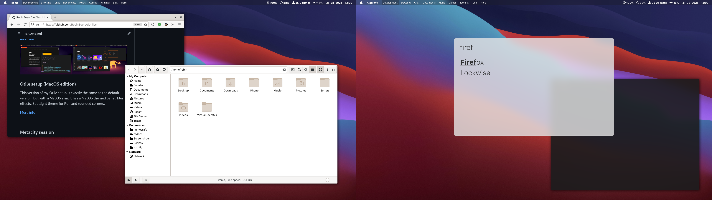
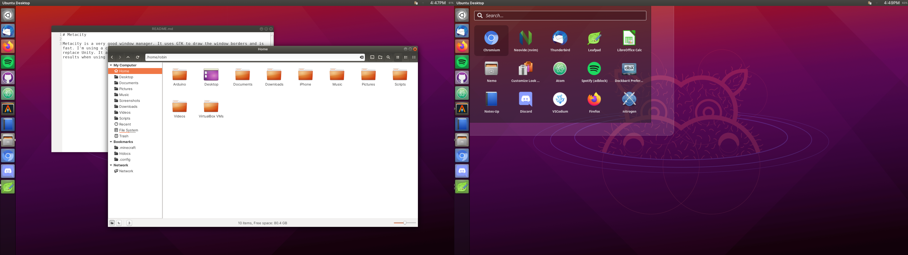

# dotfiles

My dotfiles for various programs and setups.

## Setups

I have different setups and configs for different use cases. These are the ones I use the most:

### Qtile setup

I'm using the default panel in this setup. I customized it to use the frontend-delight color theme. I use gaps because I like them. Keybindings for most regular stuff. Also keybinded the media buttons using playerctl and the brightness stuff with xbacklight. Using KvYaru for Qt and Yaru for GTK+. Using nitrogen for the wallpaper and Suru icons.

[More info](.config/qtile)


### Qtile setup (MacOS edition)

This version of my Qtile setup is exactly the same as the default version, but with a MacOS skin. It has a MacOS themed panel, blur effects, Spotlight theme for Rofi and rounded corners. KvGnome for QT and Adwaita for GTK+

[More info](.config/qtile-macos)



### Metacity session

I made a custom xsession using the Metacity window manager, DockBarX, tint2 and rofi. I wanted it to look like Unity. Ambiance GTK theme, KvAmbiance QT theme, Humanity icons.

[More info](usr/bin/)



### Openbox setup

I use the Yaru theme for openbox,  
the Yaru theme for GTK+, KvYaru for Qt and the Yaru icon theme. I like Yaru.

The dock (plank) is on the left like in Unity and for the wallpaper I'm using nitrogen.

[More info](.config/openbox)


### i3 setup

For my i3 setup I use the default bar/panel (i3bar) that I customized a bit. I also added some keybindings for stuff. I use both dmenu and rofi. I made the themes for both match the i3bar theme. Also using nitrogen for the wallpaper here. For both the GTK+ and QT theme Im using Breeze. Terminal is Alacritty. Breeze icons.

[More info](.config/i3)


## Rofi themes

[Here's a list of all my Rofi themes and what their purpose is :D](.config/rofi/)

## Packagelist

I created a packagelist to list all the packages installed on my system and to easily reinstall later. To reinstall all packages in my current setup:

```
# pacman -S --needed $(comm -12 <(pacman -Slq | sort) <(sort packages.txt))
```

To generate a (new) packagelist:

```
pacman -Qqe > packages.txt
```

## Linux Dev Environment

I use my system mostly for development, school and notes. I created a doc to describe my current dev environment based on Arch Linux.

[Linux Dev Environment](docs/dev-setup.md)

Inspired by [divyanshu013/linux-dev-setup](https://github.com/divyanshu013/linux-dev-setup).

-----

Made with <3 by me
