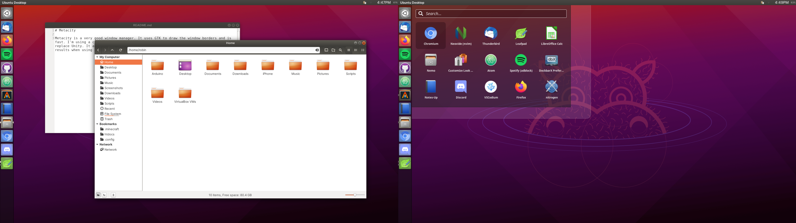

# Metacity

Metacity is a very good window manager. It uses GTK to draw the window borders and is fast. I'm using a custom xsession with Metacity, DockBarX, tint2, hud-menu and rofi to replace Unity. It also has a HUD, but it doesnt work on LibreOffice and Firefox. Best results when using the Ambiance GTK+ theme, Humanity icon theme and KvAmbiance for QT. 

Same shortcuts as my openbox setup.